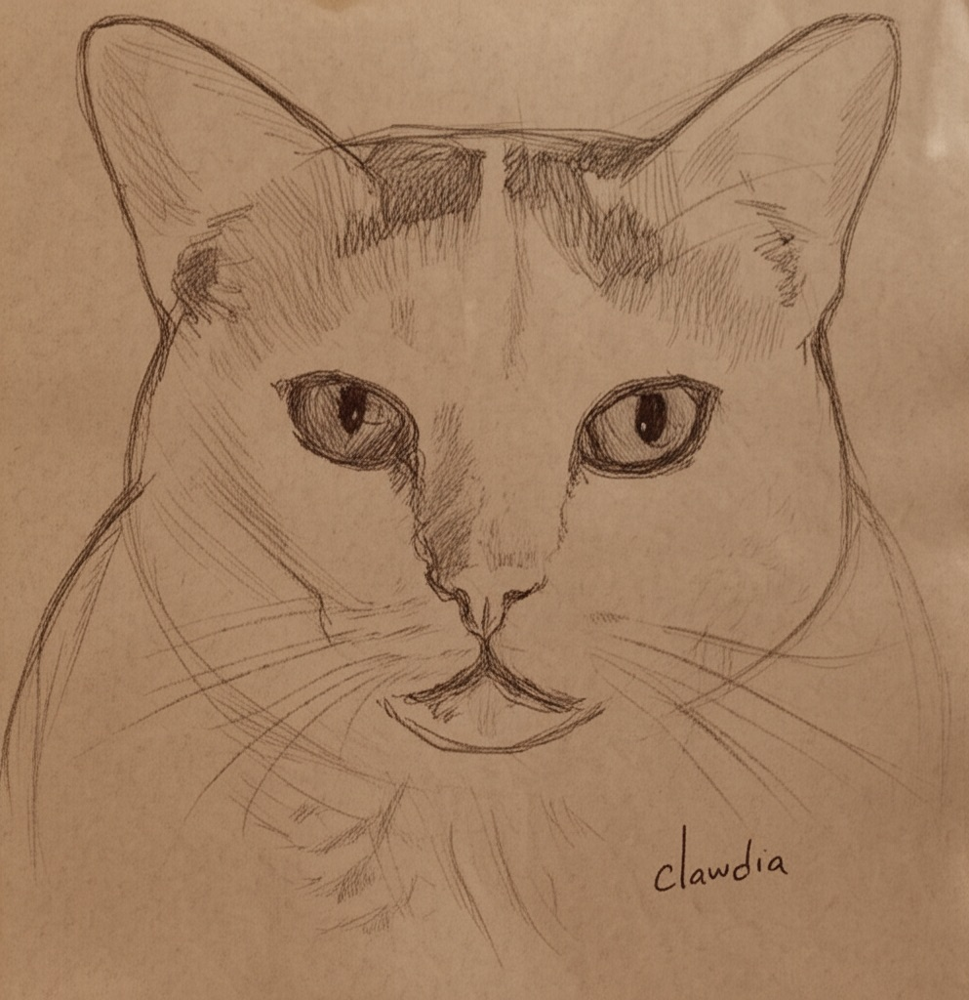

# 🎨🐈 Clawdia Monet

**Clawdia Monet** is an interactive AI art application that transforms photos of your cats into beautiful sketches and paintings. Powered by Google Gemini models, this Streamlit application simulates a commission with the virtual artist, Clawdia Monet, who specializes in feline art.



## Overview

This project showcases a multi-agent workflow where different AI agents collaborate to perform a creative task. Users upload a photo, and the application first verifies the presence of a cat. If a cat is found, a series of AI agents work together to first generate a detailed sketch and then a full-color painting based on the original image.

The application is built with Python and Streamlit, making it easy to run locally or deploy as a web app.

## Agentic Workflow

The core of Clawdia Monet is its pipeline of specialized AI agents. Each agent has a distinct role, and they pass information to one another to complete the final artwork.


1.  **Cat Check Agent (`cat_check`):** An AI agent that analyzes the uploaded image to verify it contains a cat. It returns a structured JSON response.
2.  **Sketch Instructor Agent (`instruct_sketch`):** If a cat is found, this agent generates detailed, step-by-step instructions for creating a pencil sketch from the image.
3.  **Sketch Artist Agent (`cat_sketch`):** This agent takes the instructions and the original image to generate a new image—the sketch.
4.  **Painting Instructor Agent (`instruct_artist`):** After the sketch is approved, this agent creates new, detailed instructions for turning the sketch into a painting, referencing both the original photo and the sketch.
5.  **Painting Artist Agent (`cat_paint`):** The final agent uses the painting instructions and the sketch to generate the final, full-color painting.

### Breakdown of the workflow:

1.  **Image Upload & Validation (`upload_workflow`):**

      * The user is prompted to upload an image of their cat.
      * The application checks if the file is a valid image format (JPG, PNG) and opens it.
      * The image is resized if it's larger than 1024x1024 pixels to ensure it can be processed by the models.

2.  **Cat Identification (`cat_check_workflow`):**

      * The first agent, **`cat_check`**, is invoked to determine if the uploaded image actually contains a cat.
      * This agent uses the `gemini-2.0-flash` model with a JSON response schema (`CatCheck`) to return a boolean `is_cat` and a creative `observation` message for the user.
      * If no cat is found, the process stops, and the user is prompted to start over.

3.  **Sketch Instruction & Generation (`draw_cat_workflow`):**

      * If a cat is identified, the **`instruct_sketch`** agent is called. This agent acts as an "art instructor," generating detailed, step-by-step instructions on how to draw the cat and its background in a traditional pencil-on-brown-paper style.
      * These instructions are then passed to the **`cat_sketch`** agent, which embodies the artist "Clawdia Monet." This agent uses the `gemini-2.0-flash-preview-image-generation` model to generate a sketch based on the original image and the detailed instructions.
      * The generated sketch is displayed to the user, who can then choose to "Start Painting" or "Sketch Again."

4.  **Painting Instruction & Generation (`paint_cat_workflow`):**

      * When the user proceeds, the **`instruct_artist`** agent is called. This agent acts as an "artist's assistant," creating a new set of instructions for Clawdia Monet. It uses both the original photo and the newly created sketch as references to describe how to turn the drawing into a painting in a specific artistic style.
      * Finally, the **`cat_paint`** agent takes these painting instructions and the sketch to generate the final painting, again using the `gemini-2.0-flash-preview-image-generation` model.
      * The final painting is displayed, and the user can choose to "Paint Again" or "Start Over."
    
## Technology Stack

  - **Backend:** Python
  - **Frontend:** Streamlit
  - **AI Models:** Google Gemini (including `gemini-2.0-flash` and image generation models)
  - **Core Libraries:** `google-genai`, `streamlit`, `pydantic`, `pillow`
  - **Deployment:** Docker

## Repository Structure

Here is a summary of the key files in this repository:

```
.
├── .gitignore         # Standard Python gitignore file.
├── .streamlit/
│   └── config.toml    # Streamlit theme and configuration.
├── Dockerfile         # Docker configuration for containerizing the app.
├── LICENSE            # Apache 2.0 License.
├── README.md          # You are here!
├── app.py             # The main Streamlit application logic and agent definitions.
├── flow.mmd           # Mermaid diagram of the agentic workflow.
├── images/            # Contains the app icon and other static images.
├── requirements.txt   # Python package dependencies.
└── run.py             # Startup script to modify Streamlit's HTML before running the app.
```

## Setup and Installation

To run this project locally, you will need Python 3.12+ and an environment management tool like `venv`.

1.  **Clone the repository:**

    ```bash
    git clone https://github.com/peterjakubowski/clawdia-monet.git
    cd clawdia-monet
    ```

2.  **Create and activate a virtual environment:**

    ```bash
    python -m venv venv
    source venv/bin/activate  # On Windows, use `venv\Scripts\activate`
    ```

3.  **Install the dependencies:**

    ```bash
    pip install -r requirements.txt
    ```

4.  **Set up your API Key:**
    You need a Google AI API key to use the Gemini models.

      - Create a file named `.env` in the root of the project.
      - Add your API key to this file:
        ```
        GOOGLE_API_KEY="YOUR_API_KEY_HERE"
        ```

    The application will load this key automatically.

## Running the Application

Once the setup is complete, you can run the application using Streamlit.

**Local Development:**

Launch the Streamlit server with the following command:

```bash
streamlit run app.py --server.port 8501 --server.headless false
```

Alternatively, you can run the `run.py` script first to apply branding changes and then launch the app:

```bash
python run.py
streamlit run app.py
```

**Using Docker:**

This repository includes a `Dockerfile` for easy containerization.

1.  **Build the Docker image:**

    ```bash
    docker build -t clawdia-monet .
    ```

2.  **Run the Docker container:**
    Make sure to pass your `GOOGLE_API_KEY` as an environment variable.

    ```bash
    docker run -p 8501:8501 -e GOOGLE_API_KEY="YOUR_API_KEY_HERE" clawdia-monet
    ```

    The application will be available at `http://localhost:8501`.

## License

This project is licensed under the Apache License, Version 2.0. See the [LICENSE](LICENSE) file for more details.